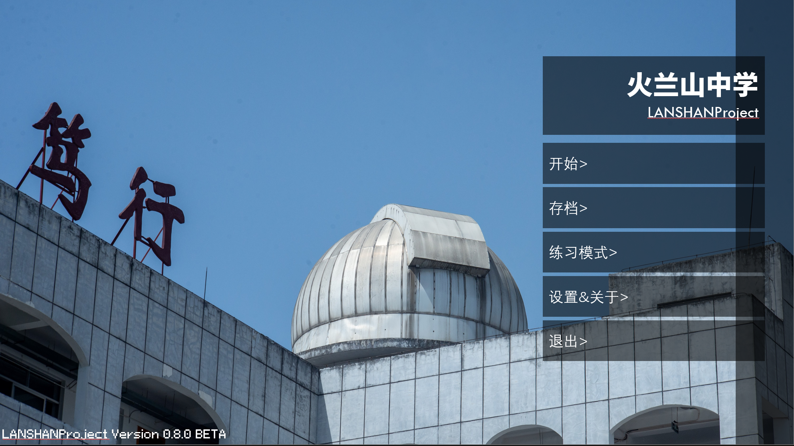
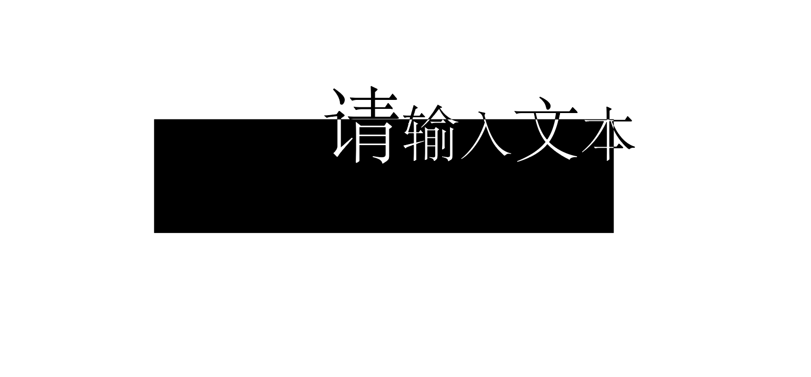
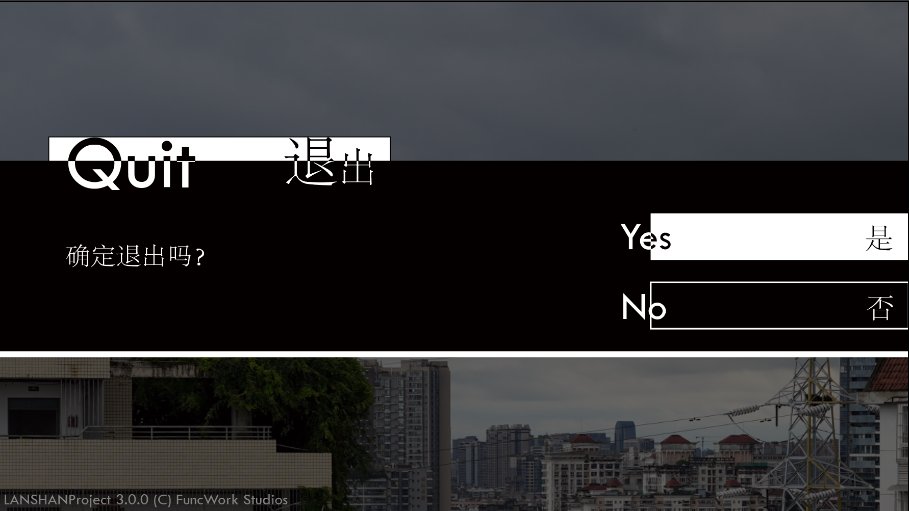
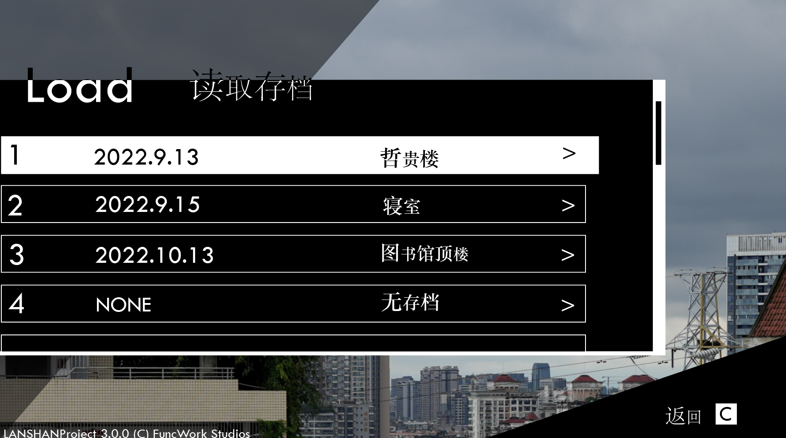
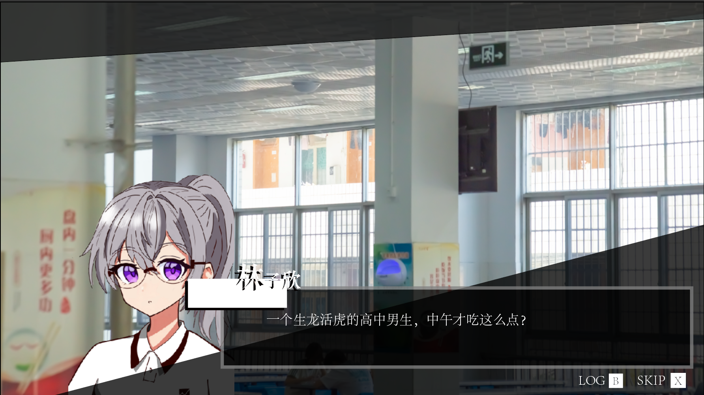
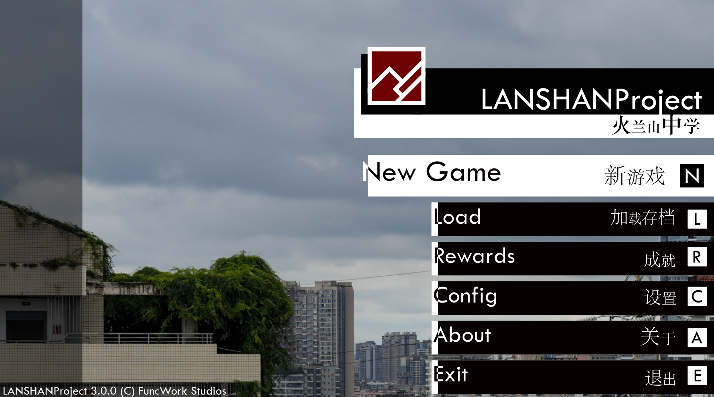

# RE:UI For LANSHANProject

在下成才

---

本文档主要介绍关于《火兰山中学》的有关设计，以供参考。

在设计这一套UI语言之前，笔者一直斟酌如何介绍这个设计。一方面，它确实出于偶然，而且描述相对较于不贴切，因此值得我在这里做一个介绍。

---

## 为什么设计

《火兰山中学》是笔者正在参与制作的2D RPG解密游戏。玩家扮演火兰山中学的学生，在火兰山中学里过着平平无奇的高中生活。主角一直都想平稳度过高中阶段，但突如其来的封校打破了原有的校园生活。逐渐的，主角开始发现了一些值得注意的事情，并通过整合推理，知道了这次“疫情”其实有着不可告人的目的，即校领导主导的生物分子计算机计划，并知道了幕后黑手的另有企图。此时，情况危急，主角团决定乘乱逃离学校。

游戏主题围绕**成长**与**反抗**展开。想为它设计好一套符合个性的设计语言，需要有打破常规的设计。

---

## 设计语言及来由

在先前的设计版本中存在着这样一些问题：**交互性太差**，**设计不统一**，而且**设计太过“稳重”和平庸**。虽然这种“稳重”的设计无伤大雅，但显然不符合游戏主题，也仍然存在改进之处。于是笔者对其打烂重做。

​	*图1 先前的UI设计*

这里简要记叙一下笔者的总体设计思路。

首先，这是一个发生在**学校**里面的故事。在学校里，天天应该是与书本为伴，书本、教辅等的印刷以黑白为主要颜色。如果你在高中阶段看过漫画看过小说，大概率也是黑白的。而且，这也是一个涉及到**计算机**的故事。计算机的命令行，一般情况下就是黑白两色。另外，黑白两色，也一定程度上影射了单调的**生活**。因此，我们就奠定了UI黑白的主色调。

其次，针对于游戏主题“理性的反叛”，这就说明一些方面并不能完完全全规整。我们试着把位于一条直线上的文字框起来，然后让文字在一定程度上“跳出来”，且大小不一。为了适应这种主题，我们把字体换成系统自带的宋体。再加上高对比的黑白与反色，于是我们得到了如下效果：

​	*图2 请输入文本*

在此基础上衍生，可以得到一个简单的菜单样式，

​	*图3 示例菜单（有待修改）*

选中部分全体反色表示以明确选择对象，

> 需要注意的是，如果背景不为白色，这种设计的边缘较难处理（不妨一试）。至于这种处理，仍需笔者和读者探索如何修正这个问题。

​	*图4 示例菜单Pro*

菜单右边的白色底色条也能当滚动条使用。

​	*图5 **有待修改**的示例对话窗口*

​	*图6 **有待修改**的主界面*